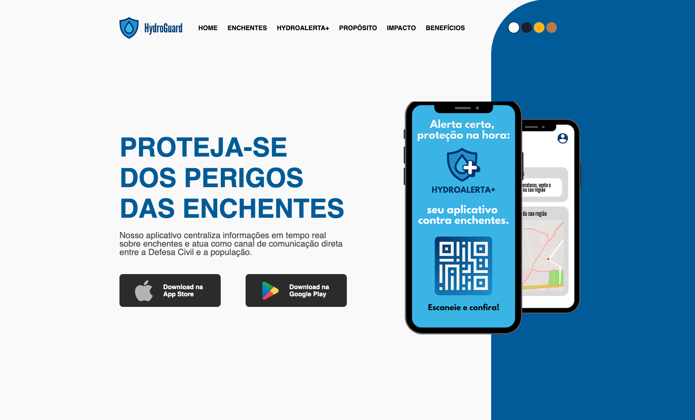

# HydroGuard - Web Frontend

Interface web institucional da solução **HydroGuard**, focada em **orientar a população** em situações de risco e **divulgar o serviço HydroAlert+**, um sistema de alertas sobre enchentes e orientações de segurança.

---

## 📚 Documentações

### 🔗 Links úteis

- 🎨 [Protótipo no Figma](https://www.figma.com/design/yQDsSLqmwE3XJyZO2ibPkb/HydroGuard?node-id=1-2&p=f&t=mEmpVsxrWBrDbWe7-0)

---

## Seções do site

  - **Home**
  - **Enchentes**
  - **Hydro Alerta+**
  - **Propósito**
  - **Impacto**
  - **Benefícios**

---

## 🎯 Propósito

O site tem como objetivo:

- Informar a população sobre **como agir em caso de enchentes**
- Apresentar **funcionalidades e diferenciais** do serviço **HydroAlerta+**
- Disponibilizar **conteúdo educativo e preventivo**
- Incentivar o uso da plataforma por **órgãos públicos, empresas e cidadãos**

---

## 📦 Tecnologias Utilizadas

- **HTML5**  
- **CSS3**  
- **JavaScript (ES6+)**  
- **Responsividade e acessibilidade** 

---

## 👩‍💻 Equipe

- Gabriel Augusto Gonçalves Pereira (RM564126)  
- Beatriz Cortêz Gomes (RM561431)  
- Bruno Henrique Campos Alves (RM563986)

---

## 📜 Licença
Este projeto é licenciado sob a **Licença MIT** - veja o arquivo [LICENSE](LICENSE) para mais detalhes.  

---

💡 _Este projeto visa fortalecer a presença digital do **HydroAlert+**, promovendo conscientização e acesso rápido a informações de segurança em situações de risco._ 🌧️📢
